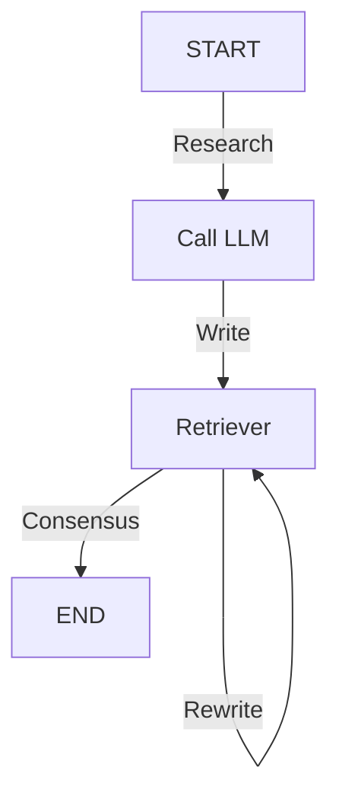

# Trabalho final de Sistemas Colaborativos

Felipe Seiji Momma Valente	12543700

Jean Patrick Ngandu Mamani       14712678

José Pedro Cioni do Carmo          12623988

Thiago Shimada			12691032

## Introducao

O cenário escolhido foi um de produção textual, onde os humanos colaboram entre si e com LLM para desenvolver textos, artigos, apresentações, entre outros. 
Inicialmente, os usuários delimitam temas, escopos e apresentam pesquisas prévias que serviram como base de dados para o RAG. 
Através do arquivo inicial e da proposta de texto a ser criado, o LLM faz pesquisas nos dados e gera um rascunho, que pode ser vetado ou aprovado através de uma votação realizada pelos colaboradores.

### Diagrama do langGraph


- Nó `Call LLM`: é responsável por delimitar o escopo da colaboração. Recebe como dados o tema inicial, quais são critérios para aceitação, estilo textual, pesquisas iniciais, entre outros. Retorna o tema ao nó de pesquisa.
- Nó `LLM Retriever`: faz parte da cooperação no modelo, recebendo o tema de pesquisa e retornando os resultados encontrados através do RAG. A sua saída é um arquivo pdf, contendo o texto que busca seguir o escopo definido inicialmente. Após o envio do arquivo, os humanos decidem, na aplicação (através de uma votação), se o documento foi aprovado ou se há necessidade de reescrevê-lo. Caso a correção seja necessária, também justificam a exigência.
- `END`: final do processo. Tem como entrada o texto aprovado, e como saída um arquivo que contém o documento formalizado.

### Abordagem do 3C

- Comunicação: A aresta Research concentra escopo, critérios e restrições. As arestas Consensus/Rewrite devolvem feedback estruturado (aprova/reprova). Entre esses nós, o Retriever funciona como “intérprete”: ele normaliza a linguagem.

- Colaboração: O LLM Research agrega dados e o LLM Drafting os integra em rascunho coerente, fazendo assim uma coautoria homem-máquina. A aresta condicional em LLM Writing gera um feedback acionável (o rótulo Rewrite volta para o Drafting quando o problema é de forma/clareza).

- Coordenação: As arestas condicionais do Research têm regras claras de avanço, se atingir consenso, flui para END, caso contrário, a lógica se mantém em Draftin

## Instalacao
```
pip install -r requirements.txt

cp .env.example .env
#altere .env com sua chave de API

python -m streamlit run .\collab_streamlit_app.py
```

## Uso

1. adicione um PDF
2. clique em Build/Update Index
3. escolha um usuario
4. Utilize o chat normalmente
5. Caso queira confirmacao para fazer alguma alteracao utilize a votacao de prompt


